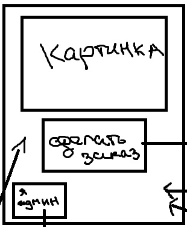
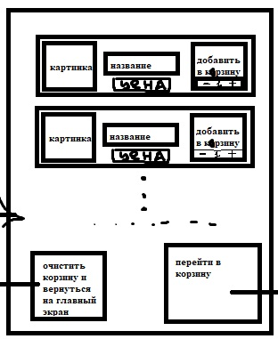

# Отчет о курсовой работе
### По курсу:
#### Основы программирования
### Работу выполнил:
#### Гулаков М.А., студент группы №3131

## Изучение предметной области

В каждом современном ресторане общественного питания существует киоск для заказа. 
Людям постоянно нужно заказывать еду, что с легкостью можно сделать через подобный киоск даже далекий от технологий пользователь.
Управляющим ресторана, в свою очередь, приходится контролировать меню, в котором содержатся все блюда: отредактировать, удалить добавить...
Целью стало создать интерфейс такого киоска, который объединяет в себе как возможность заказа еды, так и контроля состава меню.
    
## Задание
Создание интерфейса киоска для заказа еды, который будет включать в себя:
 - интерфейс для клиента ресторана:
   - добавление определенного количества блюд в корзину
   - просмотр корзины, ее редактирование
   - получение номера в очереди
 - интерфейс для управляющего составом меню:
   - авторизация администратора
   - добавить блюдо
   - редактировать блюдо
   - удалить блюдо
 - использование bootstrap для создания менее вырвиглазного дизайна, чем тот мог быть
 - использование AJAX для обновления меню/корзины
## Выбор технологий

#### Платформа:
Бесплатный хостинг sprinthost.ru
Ссылка на итоговый сайт, размещенный на данном хосте: http://f0767046.xsph.ru/
#### Среда разработки:
Visual Studio Code
#### Языки программирования:
JavaScript, PHP
#### Фреймворки:
Bootstrap

## Реализация

### Интерфейс:
- *концепт интерфейса основной страницы:*
   - 

- *концепт интерфейса меню:*
   - 

### Пользовательский сценарий:
Пользователь заходит на сайт, после видит приветствие и приглашение перейти в меню выбора или в меню для админа.

В меню выбора пользователь может:
- Выбрать блюдо и его количество
- Добавить выбранное в корзину
- Выйти на главный экран
- Перейти в корзину, в которой пользователь:
   - Перейти к оплате и узнать свой номер в очереди
   - Очистить корзину и вернуться на главную
   - вернуться в меню, чтобы дополнить корзину

В меню для админа пользователь видит страницу авторизации:
- Вернуться на главный экран
- Вводит занесенный в базу данных логин и пароль и переходит на страницу изменения меню:
   - Изменить блюдо
   - Удалить блюдо
   - Создать новое блюдо

### API сервера:

При авторизации администратора используется **fetch()**-запрос с методом **POST** и полями *login* и *password*

При добавлении блюда из меню выбора блюд в корзину используется **fetch()**-запрос с методом  **POST** и полями *user_id*, *product_id* и *count* (количество продукта)

При очищении корзины в меню выбора блюд используется **fetch()**-запрос с методом **POST** и полем *user_id*

На странице корзины используются два **fetch()**-запроса, оба с методом **POST**. Первый использует поля *product_id* и *user_id* для удаления определенного товара из корзины, второй использует поле *user_id* для полной очистки корзины.

На странице для изменения меню используется сразу три запроса **fetch()** с методами **POST**. Первый для изменения определенного блюда в меню, вторй для удаления блюда из меню, третий для создания нового блюда.

### Хореография

Пользователь попадает в **index.php**, где при нажатии кнопки *"меню для админа"* пользователь перенаправляется на страницу *"auth.php"*, где при успешной авторизации происходит перенаправление на *"editmenu.php"*, а при нажатии на кнопку *"cancel"* пользователь возвращается на главный экран. На странице *"editmenu.php"* есть кнопки:
- *"exit and go to main"*, которая возвращает пользователя на гланый экран
- *"создать"*, которая при заполнении всех данных посылает **fetch()**-запрос на **create_new_product.php**, где в базу данных при всех верных данных вносится добавленный продукт.
- *"изменить"*, которая при изменении данных посылает **fetch()**-запрос на **edit_menu_index.php**, где в базу данных вносятся изменения данного блюда.
- *"удалить"*, которая посылает **fetch()**-запрос на **delete_index.php**, где из базы данных удаляется данный продукт

Если же на главном экране пользователь выбирает кнопку *"Сделать заказ"*, то его перенаправляет в меню выбора блюд, где пользователь выбирает количество определенных блюд и при нажатии кнопки *"добавить"* отправляется **fetch()**-запрос на **add_to_cart.php**, что запоминает в базе данных для данного пользователя выбранный товар с его количеством. Кнопка *"На главную"* также отправит **fetch()**-запрос, но на **clear_cart.php**, где корзина данного пользователя очистится, а сам пользователь будет перенаправлен на главную. При нажатии на кнопку *"в корзину"* пользователь будет перенаправлен на страницу **cart.php**.

На странице **cart.php** пользователю представлен выбор его товара (или сообщение о его отсутствии) и возможности: кнопка *"Удалить"*, что посылает **fetch()**-запрос на **delete_from_cart.php**, что удаляет из корзины данный товар; кнопка *"в меню"*, что перенаправляет пользователя в меню выбора блюд; кнопка *"очистить корзину и вернуться на главную"*, название которой говорит само за себя; кнопка *"оплата"*, которая перенаправляет пользователя на **queue.php**, где пользователю представлены возможности вернуться на главный экран и увидеть свой номер в очереди.

### Структура базы данных

База данных состоит из трех таблиц:
- **admins**, со столбцами **id** (ключевой, автоинкремент), **login** (хранение логинов) и **password** (хранение паролей)
- **cart**, со столбцами **id** (ключевой, автоинкремент), **user_id** (хранение индекса определенного пользователя), **product_id** (хранение индекса выбранного продукта), **count** (количество выбранного продукта)
- **food_menu**, со столбцами **id** (ключевой, автоинкремент), **product_name** (хранение названия продукта), **product_text** (хранение описания продукта), **picture** (хранение картинки), **price** (хранение цены) 

### Алгоритмы

Алгоритм авторизации:

### Значимые фрагменты кода

**fetch()**-запрос при авторизации:

        

**fetch()**-запрос при изменении блюда в меню:

    
    
**fetch()**-запрос при удалении блюда из меню:

    
 
**fetch()**-запрос при добавлении блюда в меню

        
        
### Тестирование
Добавляем товары в корзину:

Смотрим товары в корзине:

Удаляем товар из корзины:

Переходим в оплату:

Авторизация для администраторов:

Удаление из меню блюд:

Создаем обратно:

Успешно создано:

### Внедрение

#### Файлы на хостинге:

#### База данных на хостинге:

